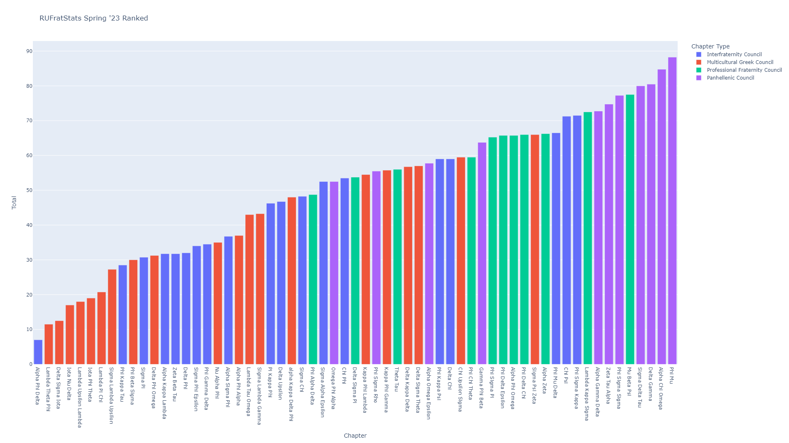

# RUFratStats
An Analysis of Rutgers Greek Life

# Explanation
[rutgersfraternityreport.xlsx](rutgersfraternityreport.xlsx) is the file that I did the manual data entry with. Historically the data did not come in a consistent format. Neither AI nor any automation was working accurately enough for me so I took a couple hours one day to manually enter the data.

[all_years_cleaned.csv](all_years_cleaned.csv) is the main file. It is amalgamation of all the data that Rutgers provides [on the official website](https://greeklife.rutgers.edu/standards-accountability/chapter-performance-statistics)

[percentile.csv](percentile.csv) is just the latest semester's data converted to percentile. This score isn't really a percentile it's 1-99 99 being the best but I named it this way because intuitive in my head.

[S23raw.csv](S23raw.csv) is just the latest semester's raw data with empty rows taken out for viewing purposes. To get the full data please see [all_years_cleaned.csv](all_years_cleaned.csv) and filter by time using your preffered method.

## Notes
The farther back this data goes the less reliable it is. There are errors I have noted in [all_years_cleaned.csv](all_years_cleaned.csv) already. Use this data carefully and before working with it look at its original source to verify its accuracy.

## Contribution
Please check the official [Rutgers Chapter Performance Statistics](https://greeklife.rutgers.edu/standards-accountability/chapter-performance-statistics) website and let me know when it updates. Further, double check all my calculations and make sure the data entry did not go wrong anywhere. This is largely done by hand and this is why I can't guarantee the data is perfectly copied 1:1.

Feel free to pull request and/or create an issue with anything you feel could be better including the website and what I should change for next semester for this ranking. 